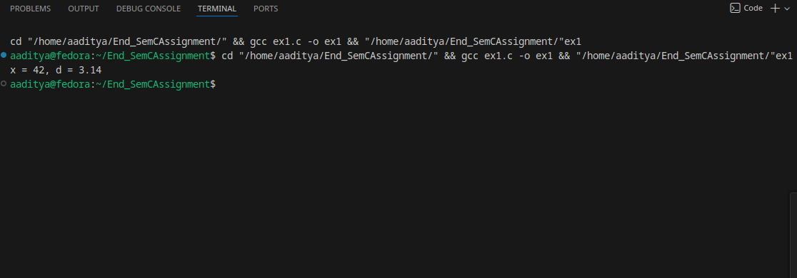
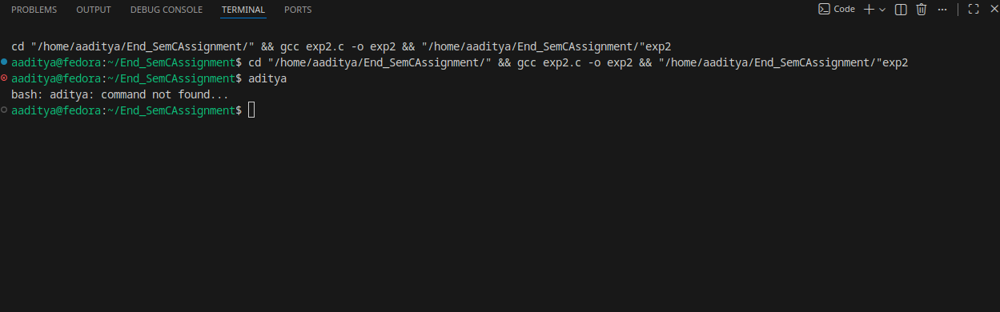
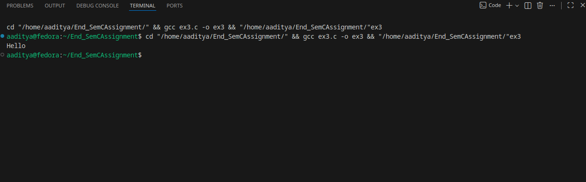
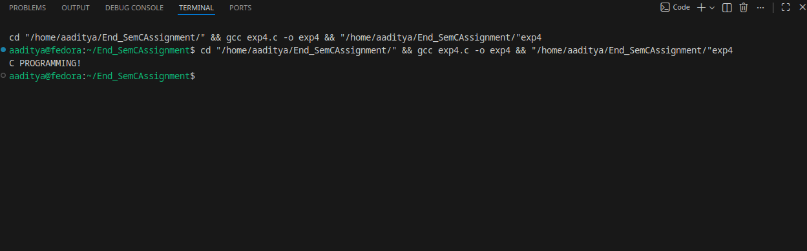
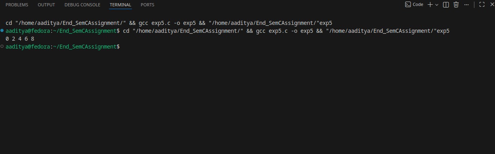
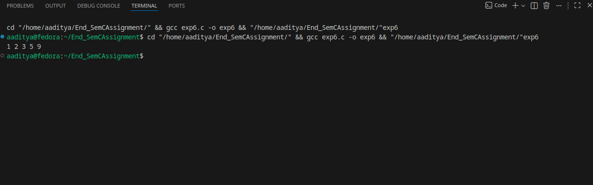
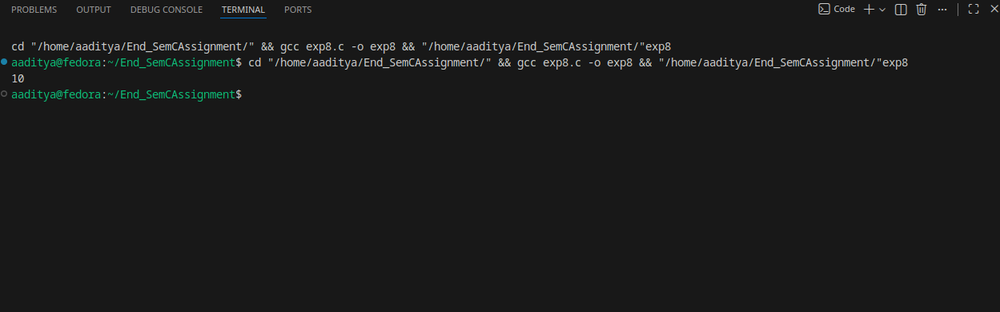
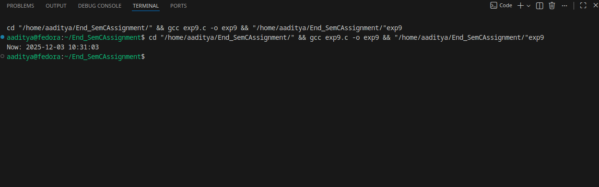

### C ASSIGNMENT 
#### ADITYA MISHRA B-78 590029219
### Q1 — Report: Usage of 10 standard library functions:
### 1) `printf` — `stdio.h`

Prototype: `int printf(const char *format, ...);`
#### Use: Print formatted text to stdout. Returns number of characters printed (or negative on error).
#### Pitfalls: Wrong format specifiers cause undefined behavior.
### Example Code:
```
#include <stdio.h>

int main(void) {
    int x = 42;
    double d = 3.14159;
    printf("x = %d, d = %.2f\n", x, d);
    return 0;
}
```
### Output:

### 2) `fopen` — `stdio.h`

Prototype: `FILE *fopen(const char *pathname, const char *mode);`
#### Use: Open a file stream for reading/writing. Returns `NULL` on failure.
#### Pitfalls: Always check return value before using the `FILE*`. Close with `fclose()`.
### Example Code:
```

#include <stdio.h>

int main(void) {
    FILE *fp = fopen("example.txt", "w");
    if (!fp) {
        perror("fopen");
        return 1;
    }
    fprintf(fp, "Hello file!\n");
    fclose(fp);
    return 0;
}
```
### Output:

### 3)`isalpha` — `ctype.h`

Prototype: int isalpha(int c);
#### Use: Test whether an int (usually an unsigned char cast to int, or EOF) is an alphabetic character. Returns nonzero if true.
#### Pitfalls: Pass only unsigned char values (or EOF); passing raw char that can be negative is undefined.
### Example Code:
```
#include <stdio.h>
#include <ctype.h>

int main(void) {
    char *s = "Hello123";
    for (const char *p = s; *p; ++p) {
        if (isalpha((unsigned char)*p))
            putchar(*p);
    }
    putchar('\n'); // prints "Hello"
    return 0;
}
```
### Output:

### 4) `toupper` — `ctype.h`

Prototype: int `toupper(int c);`
#### Use: Convert a lowercase letter to uppercase; returns converted character or original if no conversion.
#### Pitfalls: Same as isalpha: cast to unsigned char before passing.
### Example Code:
```
#include <stdio.h>
#include <ctype.h>

int main(void) {
    char s[] = "C Programming!";
    for (char *p = s; *p; ++p)
        *p = (char) toupper((unsigned char)*p);
    puts(s); // prints "C PROGRAMMING!"
    return 0;
}
```
### Output:

### 5)malloc — stdlib.h

Prototype: `void *malloc(size_t size);`
#### Use: Allocate size bytes on the heap; returns pointer or NULL.
#### Pitfalls: Always check for NULL. Remember to free() allocated memory. Avoid using uninitialized memory.
### Example Code:
```
#include <stdio.h>
#include <stdlib.h>

int main(void) {
    size_t n = 5;
    int *arr = malloc(n * sizeof *arr);
    if (!arr) { perror("malloc"); return 1; }
    for (size_t i = 0; i < n; ++i) arr[i] = (int)i * 2;
    for (size_t i = 0; i < n; ++i) printf("%d ", arr[i]);
    putchar('\n');
    free(arr);
    return 0;
}
```
### Output:

### 6)`free` — `stdlib.h`

Prototype: `void free(void *ptr);`
#### Use: Release memory previously allocated by malloc, calloc, or realloc.
#### Pitfalls: Do not free memory twice. Do not use memory after it is freed (dangling pointer). Setting pointer to NULL after free helps.

### Example
#### (See previous malloc example — free(arr); releases memory.)
### 7)`qsort` — `stdlib.h`

Prototype: `void` qsort(void *base, size_t nitems, size_t size, int (*compar)(const void *, const void *));
#### Use: Generic quicksort for arrays. Provide comparator that returns negative/0/positive.
#### Pitfalls: Comparator must follow the contract. Use correct pointer casts in comparator.
### Example Code:
```
#include <stdio.h>
#include <stdlib.h>

int cmp_ints(const void *a, const void *b) {
    int ia = *(const int *)a;
    int ib = *(const int *)b;
    return (ia > ib) - (ia < ib); // returns 1,0,-1
}

int main(void) {
    int arr[] = {5, 2, 9, 1, 3};
    size_t n = sizeof arr / sizeof arr[0];

    qsort(arr, n, sizeof arr[0], cmp_ints);

    for (size_t i = 0; i < n; ++i) printf("%d ", arr[i]);
    putchar('\n'); // prints sorted: 1 2 3 5 9
    return 0;
}
```
### Output:

### 8)`assert` — `assert.h`

Prototype: void assert(int expression); (macro)
#### Use: Diagnostic macro that aborts program if expression is false (zero) and prints file/line. Useful in debugging.
#### Pitfalls: assert can be disabled by defining NDEBUG (so don't rely on it for required runtime checks in production).
### Example Code:
```
#include <assert.h>
#include <stdio.h>

int divide(int a, int b) {
    assert(b != 0); // debug-time check
    return a / b;
}

int main(void) {
    printf("%d\n", divide(10, 2)); // OK
    // divide(10, 0); // would abort if uncommented (in debug builds)
    return 0;
}
```
### Output:

### 9)`va_start`, `va_arg`, `va_end` — `stdarg.h` (variadic support)

#### Use: Implement functions that accept variable numbers of arguments (like `printf`).
#### Pitfalls: Caller and callee must agree on types/layout; you must know how many/which types to fetch.
### Example Code:
```
#include <stdio.h>
#include <stdarg.h>

int sum_ints(int count, ...) {
    int total = 0;
    va_list ap;
    va_start(ap, count);
    for (int i = 0; i < count; ++i)
        total += va_arg(ap, int);
    va_end(ap);
    return total;
}

int main(void) {
    printf("%d\n", sum_ints(4, 1, 2, 3, 4)); // prints 10
    return 0;
}
```
### Output:

### 10)`time` — `time.h`

Prototype: `time_t` `time(time_t *tloc);`
#### Use: Get current calendar time as time_t (seconds since epoch). Often combined with localtime() / gmtime() for broken-down time.
#### Pitfalls: `time_t` representation may vary; check return -1 on error.
### Example Code:
```
#include <stdio.h>
#include <time.h>

int main(void) {
    time_t now = time(NULL);
    if (now == (time_t)-1) { perror("time"); return 1; }

    struct tm *lt = localtime(&now);
    if (!lt) { perror("localtime"); return 1; }

    printf("Now: %04d-%02d-%02d %02d:%02d:%02d\n",
        lt->tm_year + 1900, lt->tm_mon + 1, lt->tm_mday,
        lt->tm_hour, lt->tm_min, lt->tm_sec);
    return 0;
}
```
### Output:


### Q2.explain the following with suitable example variable applicable 
### 1- static lib vs shared library 
### 2-dyanamic memory allocation vs static memory allocation 
### 3-garbage collection
### Answer:
#### Static library

* File: typically `libname.a` (on Unix).

* At link time, object code from .a is copied into final executable. Result: larger executable, no runtime dependency on library files.

* Pros: portable single binary, no runtime linking; can be faster to start.

* Cons: bigger binary, harder to update (must re-link apps to update lib), duplicates code across binaries.

#### Shared (dynamic) library

* File: libname.so (Unix), libname.dylib (macOS), .dll (Windows).

* Linked at runtime (or during dynamic linking at load). Smaller executable; multiple programs share one copy in memory.

* Pros: updates to library can benefit apps without relinking; smaller disk and memory footprint.

* Cons: runtime dependency; versioning/ABI compatibility problems ("DLL Hell").
### Example:
mylib.c (library code):
```
// mylib.c
#include <stdio.h>

void greet(void) {
    puts("Hello from mylib!");
}
```
Build static library (Unix):
```
# compile object
gcc -c mylib.c -o mylib.o
# create static lib
ar rcs libmylib.a mylib.o
# compile program and link statically
gcc main.c -L. -lmylib -o prog_static
```
Build shared library (Unix):
```
# compile PIC object
gcc -fPIC -c mylib.c -o mylib.o
# create shared library
gcc -shared -o libmylib.so mylib.o
# compile program linking to shared lib
gcc main.c -L. -lmylib -o prog_shared
# run (may need LD_LIBRARY_PATH)
LD_LIBRARY_PATH=. ./prog_shared
```
`main.c` (uses the library):
```
// main.c
void greet(void); // provided by the library
int main(void) { greet(); return 0; }
```
#### 2) Dynamic memory allocation vs Static memory allocation
#### Static memory allocation (compile-time)

* Examples: global variables, static variables, and local arrays with compile-time size.

* Lifetime: static (for globals) or automatic for local non-static arrays on the stack.
#### Example:'
```
#include <stdio.h>

int global_array[100]; // static allocation (BSS/data)
int main(void) {
    int local_array[10]; // automatic (stack) allocation
    local_array[0] = 1;
    printf("%d\n", local_array[0]);
    return 0;
}
```
#### Dynamic memory allocation (runtime)

* Use malloc/calloc/realloc/free to allocate memory on the heap at runtime.

* Lifetime: from allocation until free(); you control it.
#### Example:
```
#include <stdio.h>
#include <stdlib.h>

int main(void) {
    size_t n;
    if (scanf("%zu", &n) != 1) return 1;
    int *arr = malloc(n * sizeof *arr);
    if (!arr) { perror("malloc"); return 1; }
    for (size_t i = 0; i < n; ++i) arr[i] = (int)i;
    printf("arr[0]=%d arr[last]=%d\n", arr[0], arr[n-1]);
    free(arr);
    return 0;
}
```
#### Key difference:
* Flexibility: dynamic allows sizes determined at runtime; static does not.

* Lifetime: dynamic persists until freed; automatic locals go out of scope.

* Safety: dynamic requires careful free to avoid leaks/dangling pointers.

* Performance: allocation cost and fragmentation can matter for heap; stack allocation is fast but limited size.
### Garbage collection
#### What is it?

#### Garbage collection (GC) is an automatic memory-management technique where the runtime system automatically detects and reclaims memory that the program no longer uses (unreachable objects), so the programmer does not need to call free() manually.

* C and garbage collection

* C has no built-in GC. Memory must be freed manually using free().

* Consequences: risk of memory leaks (forgot to free), double free (freeing twice), or use-after-free bugs.
#### Example:
```
#include <stdlib.h>

void leak(void) {
    int *p = malloc(100 * sizeof *p);
    // forgot to free(p);
}

int main(void) {
    for (int i = 0; i < 1000; ++i) leak(); // leaks grow
    return 0;
}
```
*********************************************************
        XXXXXXXXXXXXXXXXXXXXXXXXXXXXXXXXXXXXXXXXXXXXXX
        